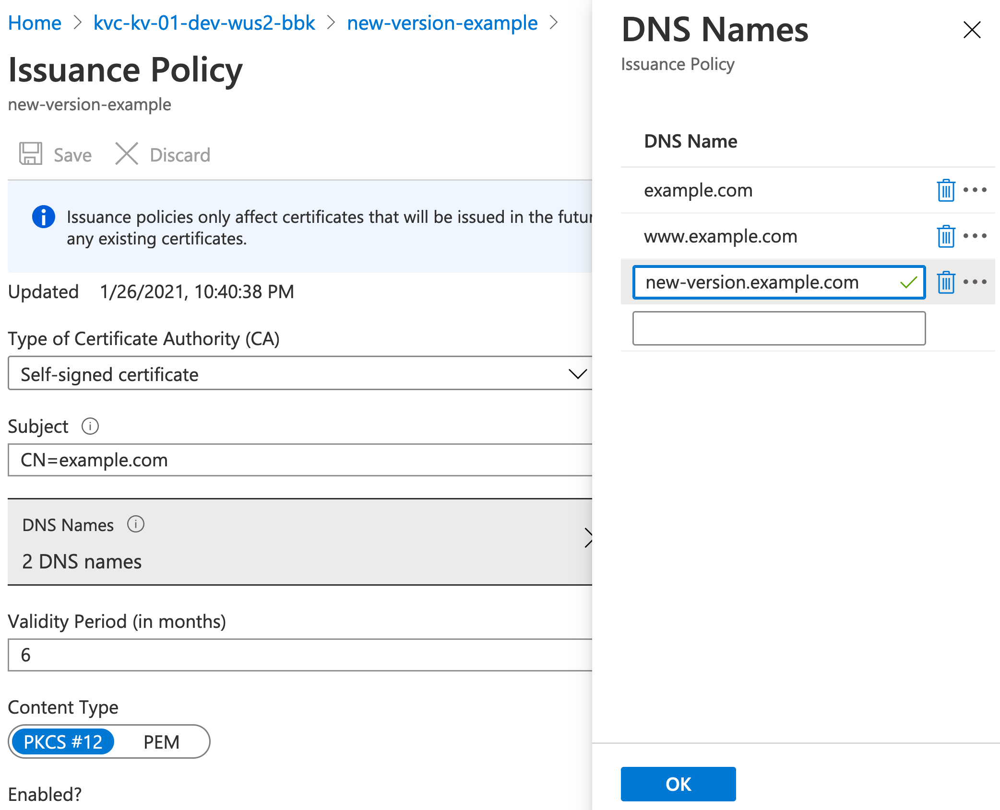

# kvcrutch

`kvcrutch` is a small tool for working with Azure Key Vaults and TLS
certificates. It's goal is to augment `az keyvault` in cases where `az
keyvault` isn't quite capable enough...

## Install

- Homebrew: `brew install bbkane/tap/kvcrutch`
- Download Mac/Linux/Windows executable: [GitHub releases](https://github.com/bbkane/kvcrutch/releases)
- Build with [goreleaser](https://goreleaser.com/): `goreleaser --snapshot --skip-publish --rm-dist`
- Build with `go`: `go build .`

## Login

Create an authorization file for `kvcrutch` with `az login`. Log in with the same credentials you'd use to view your Key Vault in the web interface.

If you're logged into multiple subscriptions, use `az account set` to set the correct on as currently active.

## Commands

### `kvcrutch config edit`

Writes [kvcrutch.yaml](./embedded/kvcrutch.yaml) if it doesn't yet exists
to config path (defaults to `~/.config/kvcrutch.yaml`) and opens the file for
editing. Specify default key vault name, default cert creation details, etc.
here in the config. Pass `--editor /path/to/editor` to overwrite the default
editor. A config needs to be created before working with certificates.

#### Example

```
kvcrutch config edit \
    -c ./kvcrutch.yaml \
    -e /usr/bin/vi
```

### `kvcrutch certificate create`
`kvcrutch certificate create` exists because `az keyvault certificate create` requires you to type a new JSON creation policy each time you invoke it, which is error prone and annoying.

In contrast, `kvcrutch certificate create`:

- looks at a config file (use `kvcrutch config edit` to generate/edit a config) for certificate creation params
- overrides config created params with passed command line flags (note that some settings can only be toggled via config)
- checks if a certificate exists with the same ID
- prompts you before creating the certificate with relevant information

#### Example

```
$ kvcrutch certificate create \
    --vault-name kvc-kv-01-dev-wus2-bbk \
    --name test-create-again \
    --subject 'CN=bbkane.com' \
    --san 'bbkane.com' \
    --san 'www.bbkane.com' \
    --tag 'key1=value1' \
    --tag 'key2=value2' \
    --validity 3 \
    --enabled \
    --new-version-ok
```

### `kvcrutch certificate new-version`

`kvcrutch certificate new-version` exists because creating a new version of a certificate from the web UI will **silently drop** any tags attached to the current certificate.

I typically use `new-version` to create a new version of a certificate after I have changed the Issuance Policy from the web UI.

#### Example

Add a SAN to the `new-version-example` certificate through the web UI:



```
$ kvcrutch certificate new-version -n new-version-example
A certificate will be created in keyvault 'https://kvc-kv-01-dev-wus2-bbk.vault.azure.net' with the following parameters:
  {
    // ... same creation JSON as before ...
        "sans": {
          "dns_names": [
            "example.com",
            "www.example.com",
            "new-version.example.com" // SAN we changed
          ]
        },
    // ... same creation JSON as before ...
    },
    "tags": { // ... tags are preserved ...
      "key1": "value2",
      "key2": "value2"
    }
  }
Type 'yes' to continue: yes
INFO: certificate created (new version)
    // ... other output details
```

### `kvcrutch certificate list`

`kvcrutch certificate list` exists because `az keyvault certificate list` only returns the first 25 certificates in a Key Vault and then just stops...

This issue is tracked in https://github.com/Azure/azure-cli/issues/15382 and if that's resolved I might remove this command.

#### Examples

Here's a small script to download all certificates to JSON files in the current directory, which can be useful to grep if you're not sure which certficate contains info you need.

```
$ kvcrutch certificate list | jq -r '.id' | while IFS='' read -r line || [ -n "${line}" ]; do
    az keyvault certificate show --id "$line" > "$(basename "$line").json"
done
```

Here's a small script to list the id and a tag value in CSV format (cribbed from [StackOverflow](https://unix.stackexchange.com/a/242740/185953))

```
$ kvcrutch certificate list | jq -rs 'map([.id, .tags.<name> ] | join(", ")) | join("\n")'
```
